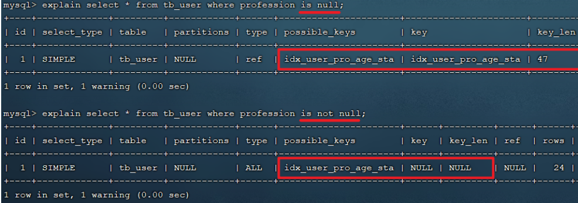
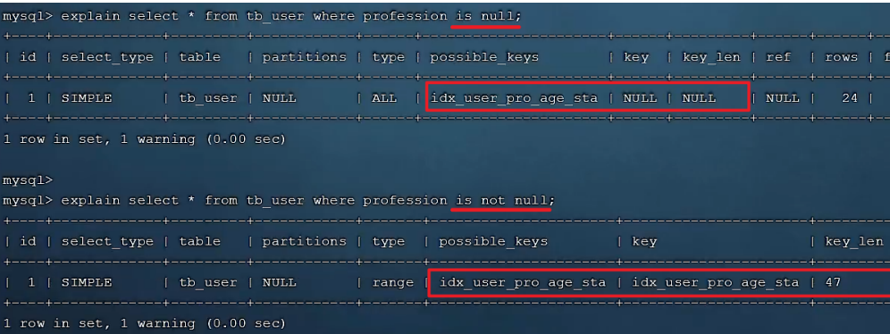

# 存储引擎

## MySQL体系结构

1. 连接层

   最上层是一些客户端和链接服务，包含本地 sock 通信和大多数基于客户端/服务端工具实现的类似于 TCP/IP的通信。主要完成一些类似于连接处理、授权认证、及相关的安全方案。在该层上引入了线程 池的概念，为通过认证安全接入的客户端提供线程。同样在该层上可以实现基于 SSL 的安全链接。服务 器也会为安全接入的每个客户端验证它所具有的操作权限。

2. 服务层

   第二层架构主要完成大多数的核心服务功能，如 SQL 接口，并完成缓存的查询，SQL 的分析和优化，部分内置函数的执行。所有跨存储引擎的功能也在这一层实现，如 过程、函数等。在该层，服务器会解 析查询并创建相应的内部解析树，并对其完成相应的优化如确定表的查询的顺序，是否利用索引等， 最后生成相应的执行操作。如果是 select 语句，服务器还会查询内部的缓存，如果缓存空间足够大， 这样在解决大量读操作的环境中能够很好的提升系统的性能。

3. 引擎层

   存储引擎层， 存储引擎真正的负责了 MySQL 中数据的存储和提取，服务器通过 API 和存储引擎进行通信。不同的存储引擎具有不同的功能，这样我们可以根据自己的需要，来选取合适的存储引擎。数据库 中的索引是在存储引擎层实现的。

4. 存储层

   数据存储层，主要是将数据（如: redolog、undolog、数据、索引、二进制日志、错误日志、查询 日志、慢查询日志等）存储在文件系统之上，并完成与存储引擎的交互。

和其他数据库相比，MySQL 有点与众不同，它的架构可以在多种不同场景中应用并发挥良好作用。主要体现在存储引擎上，插件式的存储引擎架构，将查询处理和其他的系统任务以及数据的存储提取分离。这种架构可以根据业务的需求和实际需要选择合适的存储引擎。


## 存储引擎介绍

大家可能没有听说过存储引擎，但是一定听过引擎这个词，引擎就是发动机，是一个机器的核心组件。比如，对于舰载机、直升机、火箭来说，他们都有各自的引擎，是他们最为核心的组件。而我们在选择引擎的时候，需要在合适的场景，选择合适的存储引擎，就像在直升机上，我们不能选择舰载机的引擎 一样。 

而对于存储引擎，也是一样，他是 mysql 数据库的核心，我们也需要在合适的场景选择合适的存储引擎。接下来就来介绍一下存储引擎。

存储引擎就是存储数据、建立索引、更新/查询数据等技术的实现方式 。存储引擎是基于表的，而不是基于库的，所以存储引擎也可被称为表类型。我们可以在创建表的时候，来指定选择的存储引擎，如果没有指定将自动选择默认的存储引擎。

1. 建表时指定存储引擎

   ```sql
   CREATE TABLE 表名(
   	字段1 字段1类型 [COMMENT 字段1注释],
   	......
   	字段n 字段n类型 [COMMENT 字段n注释]
   ) ENGINE = INNODB [COMMENT 表注释] ;
   ```

2. 查询当前数据库支持的存储引擎

   ```sql
   show engines;
   ```


## 存储引擎特点

### InnoDB

1. 介绍

   InnoDB 是一种兼顾高可靠性和高性能的通用存储引擎，在 MySQL 5.5 之后，InnoDB 是默认的 MySQL 存储引擎。

2. 特点

   * DML 操作遵循 ACID 模型，支持事务； 

   * 行级锁，提高并发访问性能；
   * 支持外键 FOREIGN KEY 约束，保证数据的完整性和正确性；

3. 文件

   xxx.ibd：xxx 代表的是表名，innoDB 引擎的每张表都会对应这样一个表空间文件，存储该表的表结构（frm-早期的 、sdi-新版的）、数据和索引。

   参数：innodb_file_per_table

   ```sql
   show variables like 'innodb_file_per_table';
   ```

   如果该参数开启，代表对于 InnoDB 引擎的表，每一张表都对应一个 ibd 文件。 我们直接打开 MySQL 的数据存放目录： C:\ProgramData\MySQL\MySQL Server 8.0\Data ， 这个目录下有很多文件夹，不同的文件夹代表不同的数据库，我们直接打开 itcast 文件夹。

   可以看到里面有很多的 ibd 文件，每一个 ibd 文件就对应一张表，比如：我们有一张表 account，就有这样的一个account.ibd文件，而在这个 ibd 文件中不仅存放表结构、数据，还会存放该表对应的索引信息。而该文件是基于二进制存储的，不能直接基于记事本打开，我们可以使用 mysql 提供的一 个指令 ibd2sdi ，通过该指令就可以从 ibd 文件中提取 sdi 信息，而 sdi 数据字典信息中就包含该表的表结构。

4. 逻辑存储结构

   * 表空间：InnoDB 存储引擎逻辑结构的最高层，ibd 文件其实就是表空间文件，在表空间中可以包含多个Segment段。
   * 段：表空间是由各个段组成的，常见的段有数据段、索引段、回滚段等。InnoDB中对于段的管理，都是引擎自身完成，不需要人为对其控制，一个段中包含多个区。
   * 区：区是表空间的单元结构，每个区的大小为 1M。默认情况下，InnoDB 存储引擎页大小为 16K， 即一个区中一共有64个连续的页。
   * 页：页是组成区的最小单元，页也是 InnoDB 存储引擎磁盘管理的最小单元，每个页的大小默认为 16KB。为了保证页的连续性，InnoDB 存储引擎每次从磁盘申请 4-5 个区。
   * 行：InnoDB 存储引擎是面向行的，也就是说数据是按行进行存放的，在每一行中除了定义表时所指定的字段以外，还包含两个隐藏字段(后面会详细介绍)。


### MyISAM

1. 介绍

   MyISAM是MySQL早期的默认存储引擎。

2. 特点

   不支持事务，不支持外键。

   支持表锁，不支持行锁。

   访问速度快。

3. 文件

   xxx.sdi：存储表结构信息 

   xxx.MYD：存储数据 

   xxx.MYI：存储索引


### Memory

1. 介绍

   Memory 引擎的表数据时存储在内存中的，由于受到硬件问题、或断电问题的影响，只能将这些表作为临时表或缓存使用。

2. 特点

   内存存放。

   hash索引（默认）

3. 文件

   xxx.sdi：存储表结构信息


### 区别及特点

| 特点         | InnoDB            | MyISAM | Memory |
| ------------ | ----------------- | ------ | ------ |
| 存储限制     | 64TB              | 有     | 有     |
| 事务安全     | 支持              | -      | \-     |
| 锁机制       | 行锁              | 表锁   | 表锁   |
| B+tree索引   | 支持              | 支持   | 支持   |
| Hash索引     | \-                | \-     | 支持   |
| 全文索引     | 支持(5.6版本之后) | 支持   | -      |
| 空间使用     | 高                | 低     | N/A    |
| 内存使用     | 高                | 低     | 中等   |
| 批量插入速度 | 低                | 高     | 高     |
| 支持外键     | 支持              | \-     | \-     |

> 面试题: InnoDB 引擎与 MyISAM 引擎的区别 ? 
>
> ①. InnoDB引擎, 支持事务, 而MyISAM不支持。 
>
> ②. InnoDB引擎, 支持行锁和表锁, 而MyISAM仅支持表锁, 不支持行锁。 
>
> ③. InnoDB引擎, 支持外键, 而MyISAM是不支持的。 
>
> 主要是上述三点区别，当然也可以从索引结构、存储限制等方面，更加深入的回答，具体参考如下官方文档： 
>
> https://dev.mysql.com/doc/refman/8.0/en/innodb-introduction.html 
>
> https://dev.mysql.com/doc/refman/8.0/en/myisam-storage-engine.html


## 存储引擎选择

在选择存储引擎时，应该根据应用系统的特点选择合适的存储引擎。对于复杂的应用系统，还可以根据实际情况选择多种存储引擎进行组合。

* InnoDB：是 Mysql 的默认存储引擎，支持事务、外键。如果应用对事务的完整性有比较高的要求，在并发条件下要求数据的一致性，数据操作除了插入和查询之外，还包含很多的更新、删除操作，那么 InnoDB 存储引擎是比较合适的选择。 
* MyISAM ：如果应用是以读操作和插入操作为主，只有很少的更新和删除操作，并且对事务的完整性、并发性要求不是很高，那么选择这个存储引擎是非常合适的。
* MEMORY：将所有数据保存在内存中，访问速度快，通常用于临时表及缓存。MEMORY 的缺陷就是对表的大小有限制，太大的表无法缓存在内存中，而且无法保障数据的安全性。

<br>

# 索引

## 介绍

索引（index）是帮助 MySQL 高效获取数据的数据结构（有序）。在数据之外，数据库系统还维护着满足特定查找算法的数据结构，这些数据结构以某种方式引用（指向）数据，这样就可以在这些数据结构上实现高级查找算法，这种数据结构就是索引。


## 演示

表结构及其数据如下：


假如我们要执行的 SQL 语句为：select * from user where age = 45;

1. 无索引情况

   

   在无索引情况下，就需要从第一行开始扫描，一直扫描到最后一行，我们称之为全表扫描，性能很低。

2. 有索引情况

   如果我们针对于这张表建立了索引，假设索引结构就是二叉树，那么也就意味着，会对 age 这个字段建 立一个二叉树的索引结构。

   

   此时我们在进行查询时，只需要扫描三次就可以找到数据了，极大的提高的查询的效率。

   > 备注： 这里我们只是假设索引的结构是二叉树，介绍一下索引的大概原理，只是一个示意图，并 不是索引的真实结构，索引的真实结构，后面会详细介绍。


## 特点

| 优势                                                         | 劣势                                                         |
| ------------------------------------------------------------ | ------------------------------------------------------------ |
| 提高数据检索的效率，降低数据库的 IO成本                      | 索引列也是要占用空间的。                                     |
| 通过索引列对数据进行排序，降低数据排序的成本，降低CPU的消 耗。 | 索引大大提高了查询效率，同时却也降低更新表的速度， 如对表进行 INSERT、UPDATE、DELETE时，效率降低。 |


##  索引结构

### 概述

MySQL 的索引是在存储引擎层实现的，不同的存储引擎有不同的索引结构，主要包含以下几种：

| 索引结构            | 描述                                                         |
| ------------------- | ------------------------------------------------------------ |
| B+Tree 索引         | 最常见的索引类型，大部分引擎都支持 B+ 树索引                 |
| Hash 索引           | 底层数据结构是用哈希表实现的, 只有精确匹配索引列的查询才有效, 不支持范围查询 |
| R-tree (空间索 引） | 空间索引是 MyISAM 引擎的一个特殊索引类型，主要用于地理空间数据类型，通常使用较少 |
| Full-text           | 是一种通过建立倒排索引，快速匹配文档的方式。类似于 Lucene,Solr,ES |

上述是 MySQL 中所支持的所有的索引结构，接下来，我们再来看看不同的存储引擎对于索引结构的支持情况。

| 索引        | InnoDB          | MyISAM | Memory |
| ----------- | --------------- | ------ | ------ |
| B+tree 索引 | 支持            | 支持   | 支持   |
| Hash 索引   | 不支持          | 不支持 | 支持   |
| R-tree 索引 | 不支持          | 支持   | 不支持 |
| Full-text 5 | 5.6版本之后支持 | 支持   | 不支持 |

> 注意：我们平常所说的索引，如果没有特别指明，都是指B+树结构组织的索引。


### 二叉树

假如说 MySQL 的索引结构采用二叉树的数据结构，比较理想的结构如下：


如果主键是顺序插入的，则会形成一个单向链表，结构如下：


所以，如果选择二叉树作为索引结构，会存在以下缺点：

* 顺序插入时，会形成一个链表，查询性能大大降低。
* 大数据量情况下，层级较深，检索速度慢。

因此可以选择红黑树，红黑树是一颗自平衡二叉树，那这样即使是顺序插入数据，最终形成的数据结构也是一颗平衡的二叉树，结构如下:


但是，即使如此，由于红黑树也是一颗二叉树，所以也会存在一个缺点：

* 大数据量情况下，层级较深，检索速度慢。

所以，在 MySQL 的索引结构中，并没有选择二叉树或者红黑树，而选择的是 B+Tree，那么什么是 B+Tree呢？在详解B+Tree之前，先来介绍一个 B-Tree。


### B-Tree

B-Tree，B树是一种多叉路衡查找树，相对于二叉树，B树每个节点可以有多个分支，即多叉。

以一颗最大度数（max-degree）为 5(5阶) 的 b-tree 为例，那这个B树每个节点最多存储 4 个key，5 个指针：


> 知识小贴士: 树的度数指的是一个节点的子节点个数。

我们可以通过一个可视化的网站来简单演示一下。https://www.cs.usfca.edu/~galles/visualization/BTree.html

插入一组数据： 100 65 169 368 900 556 780 35 215 1200 234 888 158 90 1000 88 120 268 250 。然后观察一些数据插入过程中，节点的变化情况。


最终我们看到，B+Tree 与 B-Tree 相比，主要有以下三点区别： 

* 所有的数据都会出现在叶子节点。
* 叶子节点形成一个单向链表。
* 非叶子节点仅仅起到索引数据作用，具体的数据都是在叶子节点存放的。


### B+Tree

B+Tree 是 B-Tree 的变种，我们以一颗最大度数（max-degree）为4（4阶）的b+tree 为例，来看一 下其结构示意图：


我们可以看到，两部分： 

* 绿色框框起来的部分，是索引部分，仅仅起到索引数据的作用，不存储数据。
* 红色框框起来的部分，是数据存储部分，在其叶子节点中要存储具体的数据。

我们可以通过一个可视化的网站来简单演示一下。https://www.cs.usfca.edu/~galles/visualization/BPlusTree.html

插入一组数据： 100 65 169 368 900 556 780 35 215 1200 234 888 158 90 1000 88 120 268 250 。然后观察一些数据插入过程中，节点的变化情况。


最终我们看到，B+Tree 与 B-Tree相比，主要有以下三点区别：

* 所有的数据都会出现在叶子节点。
* 叶子节点形成一个单向链表。
* 非叶子节点仅仅起到索引数据作用，具体的数据都是在叶子节点存放的。

上述我们所看到的结构是标准的 B+Tree 的数据结构，接下来，我们再来看看MySQL 中优化之后的 B+Tree。

MySQL 索引数据结构对经典的 B+Tree 进行了优化。在原 B+Tree 的基础上，增加一个指向相邻叶子节点的链表指针，就形成了带有顺序指针的 B+Tree，提高区间访问的性能，利于排序。


### Hash

MySQL中除了支持 B+Tree 索引，还支持一种索引类型 ---Hash 索引。

1. 结构 

   哈希索引就是采用一定的 hash 算法，将键值换算成新的hash值，映射到对应的槽位上，然后存储在 hash 表中。

   

   如果两个 (或多个) 键值，映射到一个相同的槽位上，他们就产生了 hash 冲突（也称为hash碰撞），可 以通过链表来解决。

   

2. 特点

   * Hash 索引只能用于对等比较 (=，in)，不支持范围查询（between，>，< ，...）
   * 无法利用索引完成排序操作。
   * 查询效率高，通常（不存在 hash 冲突的情况）只需要一次检索就可以了，效率通常要高于B+tree 索引。

3. 存储引擎支持

   在 MySQL 中，支持 hash 索引的是 Memory 存储引擎。 而 InnoDB 中具有自适应 hash 功能，hash 索引是 InnoDB 存储引擎根据 B+Tree 索引在指定条件下自动构建的。

> 思考题： 为什么 InnoDB 存储引擎选择使用 B+tree 索引结构？
>
> * 相对于二叉树，层级更少，搜索效率高；
> * 对于B-tree，无论是叶子节点还是非叶子节点，都会保存数据，这样导致一页中存储的键值减少，指针跟着减少，要同样保存大量数据，只能增加树的高度，导致性能降低；
> * 相对 Hash 索引，B+tree 支持范围匹配及排序操作；


## 索引分类

### 索引分类

在 MySQL 数据库，将索引的具体类型主要分为以下几类：主键索引、唯一索引、常规索引、全文索引。

| 分类     | 含义                                                 | 特点                       | 关键字   |
| -------- | ---------------------------------------------------- | -------------------------- | -------- |
| 主键索引 | 针对于表中主键创建的索引                             | 默认自动创建， 只能 有一个 | PRIMARY  |
| 唯一索引 | 避免同一个表中某数据列中的值重复                     | 可以有多个                 | UNIQUE   |
| 常规索引 | 快速定位特定数据                                     | 可以有多个                 |          |
| 全文索引 | 全文索引查找的是文本中的关键词，而不是比较索引中的值 | 可以有多个                 | FULLTEXT |


### 聚集索引&二级索引

而在在 InnoDB 存储引擎中，根据索引的存储形式，又可以分为以下两种：

| 分类                       | 含义                                                        | 特点                  |
| -------------------------- | ----------------------------------------------------------- | --------------------- |
| 聚集索引 (Clustered Index) | 将数据存储与索引放到了一块，索引结构的叶子节点保存了行数据  | 必须有，而且只 有一个 |
| 二级索引 (Secondary Index) | 将数据与索引分开存储，索引结构的叶子节点关 联的是对应的主键 | 可以存在多个          |

聚集索引选取规则：

* 如果存在主键，主键索引就是聚集索引。
* 如果不存在主键，将使用第一个唯一（UNIQUE）索引作为聚集索引。
* 如果表没有主键，或没有合适的唯一索引，则 InnoDB 会自动生成一个 rowid 作为隐藏的聚集索 引。

聚集索引和二级索引的具体结构如下：


* 聚集索引的叶子节点下挂的是这一行的数据 。
* 二级索引的叶子节点下挂的是该字段值对应的主键值。

接下来，我们来分析一下，当我们执行如下的 SQL 语句时，具体的查找过程是什么样子的。


具体过程如下：

1. 由于是根据 name 字段进行查询，所以先根据 name='Arm' 到 name 字段的二级索引中进行匹配查找。但是在二级索引中只能查找到 Arm 对应的主键值 10。
2.  由于查询返回的数据是 *，所以此时，还需要根据主键值 10，到聚集索引中查找 10 对应的记录，最 终找到 10 对应的行 row。
3. 最终拿到这一行的数据，直接返回即可。

> 回表查询： 这种先到二级索引中查找数据，找到主键值，然后再到聚集索引中根据主键值，获取 数据的方式，就称之为回表查询。

> 思考题： 以下两条SQL语句，那个执行效率高？为什么？
>
> * select * from user where id = 10 ; 
> * select * from user where name = 'Arm' ;
>
> 备注: id 为主键，name 字段创建的有索引；
>
> 解答： 
>
> A 语句的执行性能要高于 B 语句。 
>
> 因为 A 语句直接走聚集索引，直接返回数据。而 B 语句需要先查询 name 字段的二级索引，然 后再查询聚集索引，也就是需要进行回表查询。

> 
>
> 思考题： 
>
> InnoDB 主键索引的 B+tree 高度为多高呢？
>
> 
>
> 假设：
>
> 一行数据大小为 1k，一页中可以存储 16 行这样的数据。InnoDB 的指针占用 6 个字节的空间，主键即使为 bigint，占用字节数为 8。
>
> 高度为 2：
>
> n * 8 + (n + 1) * 6 = 16*1024 , 算出 n 约为 1170
>
> 1171 * 16 = 18736
>
> 也就是说，如果树的高度为 2，则可以存储 18000 多条记录。
>
> 高度为3： 
>
> 1171 * 1171 * 16 = 21939856 
>
> 也就是说，如果树的高度为 3，则可以存储 2200w 左右的记录。


## 索引语法

1. 创建索引

   ```sql
   CREATE [ UNIQUE | FULLTEXT ] INDEX index_name ON table_name (index_col_name,...);
   ```

2. 查看索引

   ```sql
   SHOW INDEX FROM table_name;
   ```

3. 删除索引

   ```sql
   DROP INDEX index_name ON table_name;
   ```

案例演示：

```sql
create table tb_user(
    id int primary key auto_increment comment '主键',
    name varchar(50) not null comment '用户名',
    phone varchar(11) not null comment '手机号',
    email varchar(100) comment '邮箱',
    profession varchar(11) comment '专业',
    age tinyint unsigned comment '年龄',
    gender char(1) comment '性别 , 1: 男, 2: 女',
    status char(1) comment '状态',
    createtime datetime comment '创建时间'
) comment '系统用户表';
```

1. name 字段为姓名字段，该字段的值可能会重复，为该字段创建索引。

   ```sql
   CREATE INDEX idx_user_name ON tb_user(name);
   ```

2. phone 手机号字段的值，是非空，且唯一的，为该字段创建唯一索引

   ```sql
   CREATE UNIQUE INDEX idx_user_phone ON tb_user(phone);
   ```

3. 为 profession、age、status 创建联合索引。

   ```sql
   CREATE INDEX idx_user_pro_age_sta ON tb_user(profession,age,status);
   ```

4. 为 email 建立合适的索引来提升查询效率。

   ```sql
   CREATE INDEX idx_email ON tb_user(email);
   ```


## SQL 性能分析

### SQL 执行频率

MySQL 客户端连接成功后，通过 show [session|global] status 命令可以提供服务器状态信息。通过如下指令，可以查看当前数据库的 INSERT、UPDATE、DELETE、SELECT 的访问频次：

```sql
-- session 是查看当前会话;
-- global 是查询全局数据;
SHOW GLOBAL STATUS LIKE 'Com_______';
```

Com_delete: 删除次数

Com_insert: 插入次数 

Com_select: 查询次数 

Com_update: 更新次数

我们可以在当前数据库再执行几次查询操作，然后再次查看执行频次，看看 Com_select 参数会不会变化。

> 通过上述指令，我们可以查看到当前数据库到底是以查询为主，还是以增删改为主，从而为数据库优化提供参考依据。如果是以增删改为主，我们可以考虑不对其进行索引的优化。如果是以查询为主，那么就要考虑对数据库的索引进行优化了。

那么通过查询 SQL 的执行频次，我们就能够知道当前数据库到底是增删改为主，还是查询为主。那假 如说是以查询为主，我们又该如何定位针对于那些查询语句进行优化呢？次数我们可以借助于慢查询日志。

接下来，我们就来介绍一下 MySQL 中的慢查询日志。


### 慢查询日志

慢查询日志记录了所有执行时间超过指定参数（long_query_time，单位：秒，默认10秒）的所有 SQL 语句的日志。

MySQL 的慢查询日志默认没有开启，我们可以查看一下系统变量 slow_query_log。

```sql
show variables like 'slow_query_log'
```

如果要开启慢查询日志，需要在 MySQL 的配置文件（/etc/my.cnf）中配置如下信息：

```mysql
# 开启MySQL 慢日志查询开关
slow_query_log=1
# 设置慢日志的时间为2秒，SQL语句执行时间超过2秒，就会视为慢查询，记录慢查询日志
long_query_time=2
```

配置完毕之后，通过以下指令重新启动 MySQL 服务器进行测试，查看慢日志文件中记录的信息 /var/lib/mysql/localhost-slow.log。

```sql
systemctl restart mysqld
```

然后，再次查看开关情况，慢查询日志就已经打开了。

测试：

1.  执行如下 SQL 语句 ：

   ```sql
   select * from tb_user; -- 这条SQL执行效率比较高, 执行耗时 0.00sec
   select count(*) from tb_sku; -- 由于tb_sku表中, 预先存入了1000w的记录, count 一次, 耗时13.35sec
   ```

2. 检查慢查询日志 ：

   最终我们发现，在慢查询日志中，只会记录执行时间超多我们预设时间（2s）的 SQL，执行较快的SQL 是不会记录的。

   那这样，通过慢查询日志，就可以定位出执行效率比较低的SQL，从而有针对性的进行优化。


### profile 详情

show profiles 能够在做 SQL 优化时帮助我们了解时间都耗费到哪里去了。通过 have_profiling 参数，能够看到当前 MySQL 是否支持 profile 操作：

```sql
SELECT @@have_profiling;
```

可以看到，当前 MySQL 是支持 profile 操作的，但是开关是关闭的。可以通过 set 语句在 session/global 级别开启 profiling：

```sql
SET profiling = 1;
```

开关已经打开了，接下来，我们所执行的 SQL 语句，都会被 MySQL 记录，并记录执行时间消耗到哪儿去 了。 我们直接执行如下的 SQL 语句：

```sql
select * from tb_user;
select * from tb_user where id = 1;
select * from tb_user where name = '白起';
select count(*) from tb_sku;
```

执行一系列的业务 SQL 的操作，然后通过如下指令查看指令的执行耗时：

```sql
-- 查看每一条 SQL 的耗时基本情况
show profiles;

-- 查看指定 query_id 的 SQL 语句各个阶段的耗时情况
show profile for query query_id;

-- 查看指定 query_id 的 SQL 语句 CPU 的使用情况
show profile cpu for query query_id;
```


### explain

EXPLAIN 或者 DESC 命令获取 MySQL 如何执行 SELECT 语句的信息，包括在 SELECT 语句执行过程中表如何连接和连接的顺序。

语法：

```sql
-- 直接在select语句之前加上关键字 explain / desc
EXPLAIN SELECT 字段列表 FROM 表名 WHERE 条件;
```

Explain 执行计划中各个字段的含义:

| 字段         | 含义                                                         |
| ------------ | ------------------------------------------------------------ |
| id           | select 查询的序列号，表示查询中执行 select 子句或者是操作表的顺序 ( id 相同，执行顺序从上到下；id 不同，值越大，越先执行)。 |
| select_type  | 表示 SELECT 的类型，常见的取值有 SIMPLE（简单表，即不使用表连接 或者子查询）、PRIMARY（主查询，即外层的查询）、 UNION（UNION 中的第二个或者后面的查询语句）、 SUBQUERY（SELECT/WHERE之后包含了子查询）等 |
| type         | 表示连接类型，性能由好到差的连接类型为 NULL、system、const、 eq_ref、ref、range、 index、all 。 |
| possible_key | 显示可能应用在这张表上的索引，一个或多个。                   |
| key          | 实际使用的索引，如果为NULL，则没有使用索引。                 |
| key_len      | 表示索引中使用的字节数，该值为索引字段最大可能长度，并非实际使用长度，在不损失精确性的前提下，长度越短越好 。 |
| rows         | MySQL 认为必须要执行查询的行数，在 innodb 引擎的表中，是一个估计值， 可能并不总是准确的。 |
| filtered     | 表示返回结果的行数占需读取行数的百分比， filtered 的值越大越好。 |


## 索引使用

### 验证索引效率

在讲解索引的使用原则之前，先通过一个简单的案例，来验证一下索引，看看是否能够通过索引来提升数据查询性能。在演示的时候，我们还是使用之前准备的一张表 tb_sku , 在这张表中准备了1000w 的记录。

这张表中 id 为主键，有主键索引，而其他字段是没有建立索引的。我们先来查询其中的一条记录，看 看里面的字段情况，执行如下SQL：

```sql
select * from tb_sku where id = 1\G;
```

可以看到即使有 1000w 的数据，根据 id 进行数据查询，性能依然很快，因为主键 id 是有索引的。 那么接 下来，我们再来根据 sn 字段进行查询，执行如下SQL：

```sql
SELECT * FROM tb_sku WHERE sn = '100000003145001';
```

我们可以看到根据sn字段进行查询，查询返回了一条数据，结果耗时 20.78sec，就是因为 sn 没有索 引，而造成查询效率很低。

那么我们可以针对于sn字段，建立一个索引，建立了索引之后，我们再次根据 sn 进行查询，再来看一 下查询耗时情况。创建索引：

```sql
create index idx_sku_sn on tb_sku(sn);
```

然后再次执行相同的SQL语句，再次查看SQL的耗时。

```sql
SELECT * FROM tb_sku WHERE sn = '100000003145001';
```

我们明显会看到，sn 字段建立了索引之后，查询性能大大提升。建立索引前后，查询耗时都不是一个数 量级的。

### 最左前缀法则

如果索引了多列（联合索引），要遵守最左前缀法则。最左前缀法则指的是查询从索引的最左列开始， 并且不跳过索引中的列。如果跳跃某一列，索引将会部分失效 (后面的字段索引失效) 。

以 tb_user 表为例，我们先来查看一下之前 tb_user 表所创建的索引。


在 tb_user  表中，有一个联合索引，这个联合索引涉及到三个字段，顺序分别为：profession， age，status。

对于最左前缀法则指的是，查询时，最左变的列，也就是 profession 必须存在，否则索引全部失效。 而且中间不能跳过某一列，否则该列后面的字段索引将失效。接下来，我们来演示几组案例，看一下 具体的执行计划：

```sql
explain select * from tb_user where profession = '软件工程' and age = 31 and status = '0';
```

```sql
 explain select * from tb_user where profession = '软件工程' and age = 31;
```

```sql
explain select * from tb_user where profession = '软件工程';
```

以上的这三组测试中，我们发现只要联合索引最左边的字段 profession 存在，索引就会生效，只不 过索引的长度不同。而且由以上三组测试，我们也可以推测出 profession 字段索引长度为 47、age 字段索引长度为 2、status 字段索引长度为5。

```sql
explain select * from tb_user where age = 31 and status = '0';
```

```sql
explain select * from tb_user where status = '0';
```

而通过上面的这两组测试，我们也可以看到索引并未生效，原因是因为不满足最左前缀法则，联合索引 最左边的列 profession 不存在。

```sql
explain select * from tb_user where profession = '软件工程' and status = '0';
```

上述的 SQL 查询时，存在 profession 字段，最左边的列是存在的，索引满足最左前缀法则的基本条 件。但是查询时，跳过了age这个列，所以后面的列索引是不会使用的，也就是索引部分生效，所以索 引的长度就是 47。

> 思考题：
>
> 当执行 SQL 语句: explain select * from tb_user where age = 31 and status = '0' and profession = '软件工程'；时，是否满足最左前缀法则，走不走 上述的联合索引，索引长度？
>
> 
>
> 可以看到，是完全满足最左前缀法则的，索引长度 54，联合索引是生效的。
>
> 注意 ： 最左前缀法则中指的最左边的列，是指在查询时，联合索引的最左边的字段（即是第一个字段）必须存在，与我们编写 SQL 时，条件编写的先后顺序无关。


### 范围查询

联合索引中，出现范围查询 (>,<)，范围查询右侧的列索引失效。

```sql
explain select * from tb_user where profession = '软件工程' and age > 30 and status= '0';
```


当范围查询使用> 或 < 时，走联合索引了，但是索引的长度为 49，就说明范围查询右边的 status 字段是没有走索引的。

```sql
explain select * from tb_user where profession = '软件工程' and age >= 30 and status = '0';
```


当范围查询使用 >= 或 <= 时，走联合索引了，但是索引的长度为 54，就说明所有的字段都是走索引 的。

所以，在业务允许的情况下，尽可能的使用类似于 >= 或 <= 这类的范围查询，而避免使用 > 或 <。


### 索引失效情况

#### 索引列运算

不要在索引列上进行运算操作，索引将失效。

在 tb_user 表中，除了前面介绍的联合索引之外，还有一个索引，是 phone 字段的单列索引。


1. 当根据 phone 字段进行等值匹配查询时, 索引生效。

   ```sql
   explain select * from tb_user where phone = '17799990015';
   ```

2.  当根据p hone 字段进行函数运算操作之后，索引失效。

   ```sql
   explain select * from tb_user where substring(phone,10,2) = '15';
   ```


#### 字符串不加引号

字符串类型字段使用时，不加引号，索引将失效。

```sql
explain select * from tb_user where profession = '软件工程' and age = 31 and status = '0';
explain select * from tb_user where profession = '软件工程' and age = 31 and status = 0;
```

如果字符串不加单引号，对于查询结果，没什么影响，但是数据库存在隐式类型转换，索引将失效。


#### 模糊查询

如果仅仅是尾部模糊匹配，索引不会失效。如果是头部模糊匹配，索引失效。

接下来，我们来看一下这三条 SQL 语句的执行效果，查看一下其执行计划： 

由于下面查询语句中，都是根据 profession 字段查询，符合最左前缀法则，联合索引是可以生效的， 我们主要看一下，模糊查询时，% 加在关键字之前，和加在关键字之后的影响。

```sql
explain select * from tb_user where profession like '软件%';
explain select * from tb_user where profession like '%工程';
explain select * from tb_user where profession like '%工%';
```

在 like 模糊查询中，在关键字后面加 %，索引可以生效。而如果在关键字前面加了 %，索引将会失效。


#### or 连接条件

用 or 分割开的条件， 如果 or 前的条件中的列有索引，而后面的列中没有索引，那么涉及的索引都不会 被用到。

```sql
explain select * from tb_user where id = 10 or age = 23;
explain select * from tb_user where phone = '17799990017' or age = 23;
```

由于 age 没有索引，所以即使 id、phone 有索引，索引也会失效。所以需要针对于 age 也要建立索引。

当 or 连接的条件，左右两侧字段都有索引时，索引才会生效。


#### 数据分布影响

如果 MySQL 评估使用索引比全表更慢，则不使用索引。

```sql
select * from tb_user where phone >= '17799990005';
select * from tb_user where phone >= '17799990015';
```


经过测试我们发现，相同的 SQL 语句，只是传入的字段值不同，最终的执行计划也完全不一样，这是为 什么呢？

就是因为 MySQL 在查询时，会评估使用索引的效率与走全表扫描的效率，如果走全表扫描更快，则放弃索引，走全表扫描。因为索引是用来索引少量数据的，如果通过索引查询返回大批量的数据，则还不 如走全表扫描来的快，此时索引就会失效。

接下来，我们再来看看 is null 与 is not null 操作是否走索引。

执行如下两条语句 ：

```sql
explain select * from tb_user where profession is null;
explain select * from tb_user where profession is not null;
```



接下来，我们做一个操作将 profession 字段值全部更新为 null。

```sql
update tb_user set profession = null;
```

然后，再次执行上述的两条 SQL，查看 SQL 语句的执行计划。



最终我们看到，一模一样的 SQL 语句，先后执行了两次，结果查询计划是不一样的，为什么会出现这种 现象，这是和数据库的数据分布有关系。查询时 MySQL 会评估，走索引快，还是全表扫描快，如果全表扫描更快，则放弃索引走全表扫描。 因此，is null 、is not null 是否走索引，得具体情况具体分析，并不是固定的。


### SQL提示

