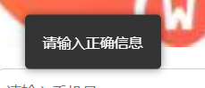

# 自定义 1

## 预览



## html

```html
<!-- 创建一个提示框元素 -->
<div id="myAlert" class="alert-box">
    <p>{{alertMessage}}</p>
</div>
```

## js

```js
showAlertBox(message) {
    var alertBox = document.getElementById('myAlert')
    if (alertBox.classList.contains('show')) {
        return
    }
    alertBox.classList.add('show')
    alertBox.classList.remove('hide')
    this.alertMessage = message
    setTimeout(function() {
        alertBox.classList.remove('show')
        alertBox.classList.add('hide')
        setTimeout(function() {
            alertBox.classList.remove('hide')
        }, 300)
    }, 1500)
}
```

## css

```css
.alert-box {
    position: fixed;
    top: 50%;
    left: 50%;
    padding: 20px;
    background-color: #333;
    color: #fff;
    border-radius: 5px;
    box-shadow: 0 0 10px rgba(0,0,0,0.5);
    opacity: 0;
    visibility: hidden;
    transition: opacity 0.3s ease-in-out, visibility 0s 0.3s, transform 0.3s ease-in-out;
    z-index: 1000;
    transform: translate(-50%, -50%) scale(0.9); /* 初始时稍微缩小 */
}

.alert-box.show {
    opacity: 1;
    visibility: visible;
    transform: translate(-50%, -50%) scale(1); /* 显示时恢复原始大小 */
}

.alert-box.hide {
    opacity: 0;
    visibility: hidden;
    transform: translate(-50%, -50%) scale(0.9); /* 隐藏时稍微缩小 */
    transition: opacity 0.3s ease-in-out, visibility 0s 0.3s, transform 0.3s ease-in-out;
}
```

