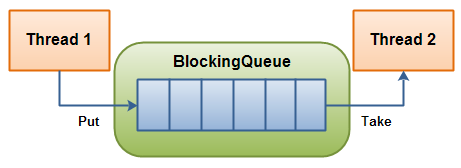

https://jenkov.com/tutorials/java-util-concurrent/blockingqueue.html


Java 的 BlockingQueue 接口，即 java.util.concurrent.BlockingQueue，代表一个线程安全的队列，可以安全地往队列中放入元素和从队列中取出元素。换句话说，多个线程可以并发地从 BlockingQueue 中插入和取出元素，而不会产生任何并发问题。

之所以叫“阻塞队列”，是因为 BlockingQueue 能够阻塞式地尝试从队列中插入或取出元素。例如，如果一个线程尝试从队列中取出一个元素，但队列中已经没有元素了，那么这个线程就会被阻塞，直到有元素可取。线程是否被阻塞取决于你在 BlockingQueue 上调用的是哪种方法。后面会详细解释不同的方法。

# BlockingQueue 的实现

由于 BlockingQueue 是一个接口，你需要使用它的一个实现来使用它。java.util.concurrent 包中提供了 BlockingQueue 接口的以下实现：

* ArrayBlockingQueue
* DelayQueue
* LinkedBlockingQueue
* LinkedBlockingDeque
* LinkedTransferQueue
* PriorityBlockingQueue
* SynchronousQueue

# BlockingQueue 的使用

一个阻塞队列通常用于给一个线程生产对象，另一个线程消费这些对象。以下是一个示意图：



生产线程会持续地生产新对象并将它们插入到阻塞队列中，直到队列达到其所能容纳的上限。换句话说，如果阻塞队列达到了其上限，生产线程在尝试插入新对象时会被阻塞。它会保持阻塞状态，直到消费线程从队列中取出一个对象。

消费线程则持续从阻塞队列中取出对象进行处理。如果消费线程尝试从一个空的队列中取出对象，那么消费线程会被阻塞，直到生产线程将一个对象放入队列中。

## BlockingQueue 方法

Java 的 BlockingQueue 接口有四组不同的方法来插入、删除和检查队列中的元素。在无法立即执行请求的操作时，每组方法的行为会有所不同。以下是方法的表格：

|          | 抛出异常  |  特殊值  |  阻塞  |            超时             |
| :------: | :-------: | :------: | :----: | :-------------------------: |
| **插入** |  add(o)   | offer(o) | put(o) | offer(o, timeout, timeunit) |
| **移除** | remove(o) |  poll()  | take() |   poll(timeout, timeunit)   |
| **检查** | element() |  peek()  |        |                             |

标题含义如下：

1. **抛出异常**：

   如果尝试的操作无法立即执行，将抛出异常。

2. **特殊值**：

   如果尝试的操作无法立即执行，将返回特殊值（通常为true/false）。

3. **阻塞**：

   如果尝试的操作无法立即执行，方法调用将阻塞，直到可以执行为止。

4. **超时**：

   如果尝试的操作无法立即执行，方法调用将阻塞，直到可以执行为止，但等待时间不会超过给定的超时时间。返回特殊值，表示操作是否成功（通常为true/false）。

无法将 null 值插入 BlockingQueue 中。如果尝试插入 null 值，BlockingQueue 将抛出 NullPointerException。

此外，我们可以访问 BlockingQueue 中的所有元素，而不仅仅是开始和结束位置的元素。例如，假设我们已经往队列里插入了一个对象，而后想要移除它，那么，可以调用 remove(o) 来删除队列中的特定对象。但是，这样做效率并不高，因此除非确实需要，否则不应该使用这些集合方法。

# BlockingQueue 示例

下面是 BlockingQueue 的一个示例，该示例使用了 ArrayBlockingQueue 作为实现。

首先，BlockingQueueExample 类分别在单独的线程中启动一个生产者（Producer）和一个消费者（Consumer）。生产者将字符串插入到共享的 BlockingQueue 中，而消费者则从中取出字符串。

```java
public class BlockingQueueExample {

    public static void main(String[] args) throws Exception {

        BlockingQueue queue = new ArrayBlockingQueue(1024);

        Producer producer = new Producer(queue);
        Consumer consumer = new Consumer(queue);

        new Thread(producer).start();
        new Thread(consumer).start();

        Thread.sleep(4000);
    }
}
```

下面是生产者（Producer）类的代码，它在每次 put() 调用之间休眠了一秒钟，这将导致消费者在等待队列中的对象时被阻塞。

```java
public class Producer implements Runnable{

    protected BlockingQueue queue = null;

    public Producer(BlockingQueue queue) {
        this.queue = queue;
    }

    public void run() {
        try {
            queue.put("1");
            Thread.sleep(1000);
            queue.put("2");
            Thread.sleep(1000);
            queue.put("3");
        } catch (InterruptedException e) {
            e.printStackTrace();
        }
    }
}
```

以下是消费者（Consumer）类的代码，它从队列中取出对象，并将它们打印到 System.out 上。

```java
public class Consumer implements Runnable{

    protected BlockingQueue queue = null;

    public Consumer(BlockingQueue queue) {
        this.queue = queue;
    }

    public void run() {
        try {
            System.out.println(queue.take());
            System.out.println(queue.take());
            System.out.println(queue.take());
        } catch (InterruptedException e) {
            e.printStackTrace();
        }
    }
}
```

# add()

Java 的 BlockingQueue 的 add() 方法会将作为参数传递的元素添加到这个队列中，前提是 BlockingQueue 内部有足够的空间。如果 BlockingQueue 内部没有空间来存放这个新元素，add() 方法会抛出一个 IllegalStateException 异常。

# offer()

如果 BlockingQueue 内部有足够的空间，BlockingQueue 的 offer() 方法会将作为参数传递的元素添加到这个队列中。如果 BlockingQueue 内部没有空间来存放这个新元素，offer() 方法将返回 false。

# offer(long millis, TimeUnit timeUnit)


选项卡切换

小区发布住宅

