# 初始步骤

1. 右边详情本地设置，基础库改掉，不要灰度。

2. 更改背景色，改成白色吧。

3. 不使用 skyline 引擎。

   app.json ，删除 skyline 那一块，rederer 改成 webview，navigationStyle 改成 default。

   ```json
   {
     "window": {
       "navigationBarTextStyle": "black",
       "navigationStyle": "default"
     },
     "renderer": "webview",
     "rendererOptions": {
     },
   }  
   
   ```

   

# 项目结构

## 基本组成结构

1. pages 用来存放所有小程序的页面 
2. utils 用来存放工具性质的模块（例如：格式化时间的自定义模块）
3. app.js 小程序项目的入口文件 
4. app.json 小程序项目的全局配置文件
5. app.wxss 小程序项目的全局样式文件 
6. project.config.json 项目的配置文件 
7. sitemap.json 用来配置小程序及其页面是否允许被微信索引


## 页面的组成部分

其中，每个页面由 4 个基本文件组成，它们分别是：

1. js 文件（页面的脚本文件，存放页面的数据、事件处理函数等）
2. json 文件（当前页面的配置文件，配置窗口的外观、表现等）
3. wxml 文件（页面的模板结构文件）
4. wxss 文件（当前页面的样式表文件）


## JSON 配置文件

### JSON 配置文件的作用

JSON 是一种数据格式，在实际开发中，JSON 总是以配置文件的形式出现。小程序项目中也不例外：通过不同 的 .json 配置文件，可以对小程序项目进行不同级别的配置。

小程序项目中有 4 种 json 配置文件，分别是：

1. 项目根目录中的 app.json 配置文件 
2. 项目根目录中的 project.config.json 配置文件 
3. 项目根目录中的 sitemap.json 配置文件 
4. 每个页面文件夹中的 .json 配置文件


### app.json 文件

app.json 是当前小程序的全局配置，包括了小程序的所有页面路径、窗口外观、界面表现、底部 tab 等。 Demo 项目里边的 app.json 配置内容如下：

1. pages：用来记录当前小程序所有页面的路径。
2. window：全局定义小程序所有页面的背景色、文字颜色等。
3. style：全局定义小程序组件所使用的样式版本。
4. sitemapLocation：用来指明 sitemap.json 的位置。


###  project.config.json 文件

project.config.json 是项目配置文件，用来记录我们对小程序开发工具所做的个性化配置，例如：

1. setting 中保存了编译相关的配置。
2. projectname 中保存的是项目名称。
3. appid 中保存的是小程序的账号 ID。


###  sitemap.json 文件

微信现已开放小程序内搜索，效果类似于 PC 网页的 SEO。sitemap.json 文件用来配置小程序页面是否允许微信索引。当开发者允许微信索引时，微信会通过爬虫的形式，为小程序的页面内容建立索引。当用户的搜索关键字和页面的索引匹配成功的时候，小程序的页面将可能展示在搜索结果中。


### 页面的 .json 配置文件

小程序中的每一个页面，可以使用 .json 文件来对本页面的窗口外观进行配置，页面中的配置项会覆盖 app.json 的 window 中相同的配置项。例如：

```json
{
  "usingComponents": {
    "navigation-bar": "/components/navigation-bar/navigation-bar"
  },
  "navigationBarBackgroundColor": "#00b26a"
}
```

导航栏颜色会替代原有的白色变成绿色。


## 新建小程序页面

只需要在 app.json -> pages 中新增页面的存放路径，小程序开发者工具即可帮我们自动创建对应的页面文件。

```json
{
  "pages": [
    "pages/index/index",
    "pages/list/list"
  ],
}
```

其他啥也不用写，会自动生成页面。


## 修改项目首页

只需要调整 app.json -> pages 数组中页面路径的前后顺序，即可修改项目的首页。小程序会把排在第一位的页 面，当作项目首页进行渲染。

```json
{
  "pages": [
    "pages/list/list"
    "pages/index/index",
  ],
}
```

改成 list 为项目首页。


# WXML 模板

## 什么是 WXML

WXML（WeiXin Markup Language）是小程序框架设计的一套标签语言，用来构建小程序页面的结构，其作用类似于网页开发中的 HTML。


## WXML 和 HTML 的区别

1. 标签名称不同

   * HTML （div, span, img, a） 

   * WXML（view, text, image, navigator）

2. 属性节点不同

   * `<a href="#">超链接</a>`
   * `<navigator url="/pages/home/home"></navigator>`

3. 提供了类似于 Vue 中的模板语法

   * 数据绑定
   * 列表渲染
   * 条件渲染


# WXSS 样式

## 什么是 WXSS

WXSS (WeiXin Style Sheets)是一套样式语言，用于描述 WXML 的组件样式，类似于网页开发中的 CSS。


## WXSS 和 CSS 的区别

1. 新增了 rpx 尺寸单位。
   * CSS 中需要手动进行像素单位换算，例如 rem。
   * WXSS 在底层支持新的尺寸单位 rpx，在不同大小的屏幕上小程序会自动进行换算。
2. 提供了全局的样式和局部样式。
   * 项目根目录中的 app.wxss 会作用于所有小程序页面。
   * 局部页面的 .wxss 样式仅对当前页面生效。
3. WXSS 仅支持部分 CSS 选择器。
   * .class 和 #id
   * element
   * 并集选择器、后代选择器
   * ::after 和 ::before 等伪类选择器


# JS 逻辑交互

## 小程序中的 .js 文件

一个项目仅仅提供界面展示是不够的，在小程序中，我们通过 .js 文件来处理用户的操作。例如：响应用户的 点击、获取用户的位置等等。


## 小程序中 .js 文件的分类

1. app.js

   是整个小程序项目的入口文件，通过调用 App() 函数来启动整个小程序。

2. 页面的 .js 文件

   是页面的入口文件，通过调用 Page() 函数来创建并运行页面。

3. 普通的 .js 文件

   是普通的功能模块文件，用来封装公共的函数或属性供页面使用。


# 宿主环境

## 什么是宿主环境

宿主环境（host environment）指的是程序运行所必须的依赖环境。例如：Android 系统和 iOS 系统是两个不同的宿主环境。安卓版的微信 App 是不能在 iOS 环境下运行的，所以，Android 是安卓软件的宿主环境，脱离了宿主环境的软件是没有任何意义的！


## 小程序的宿主环境

手机微信是小程序的宿主环境。

小程序借助宿主环境提供的能力，可以完成许多普通网页无法完成的功能，例如：
微信扫码、微信支付、微信登录、地理定位、etc…


## 小程序宿主环境包含的内容

1. 通信模型。
2. 运行机制。
3. 组件。
4. API。


## 通信模型

### 通信的主体

小程序中通信的主体是渲染层和逻辑层，其中：

1. WXML 模板和 WXSS 样式工作在渲染层。
2. JS 脚本工作在逻辑层。

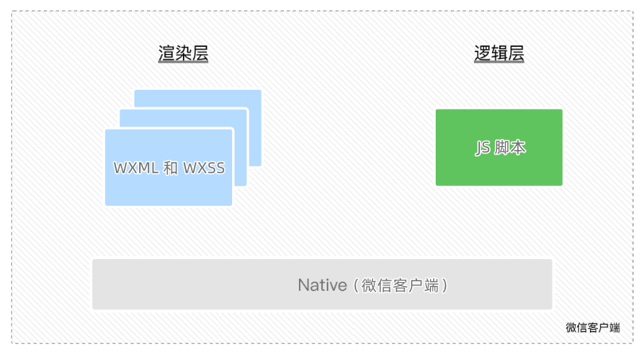


### 小程序的通信模型

小程序中的通信模型分为两部分：

1. 渲染层和逻辑层之间的通信

   由微信客户端进行转发

2. 逻辑层和第三方服务器之间的通信

   由微信客户端进行转发

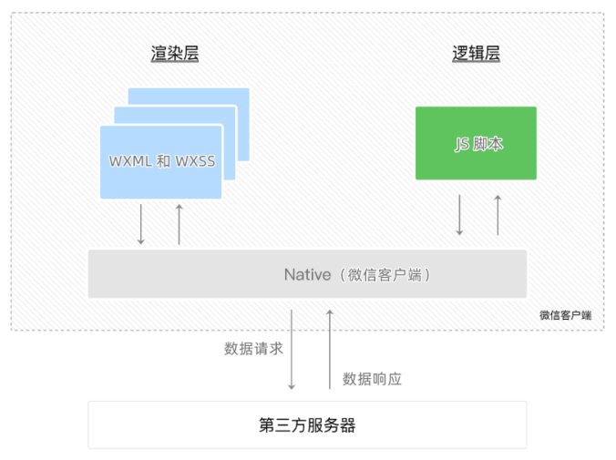


## 运行机制

### 小程序启动的过程

1. 把小程序的代码包下载到本地。
2. 解析 app.json 全局配置文件。
3. 执行 app.js 小程序入口文件，调用 App() 创建小程序实例。
4. 渲染小程序首页。
5. 小程序启动完成。


### 页面渲染的过程

1. 加载解析页面的 .json 配置文件
2. 加载页面的 .wxml 模板和 .wxss 样式
3. 执行页面的 .js 文件，调用 Page() 创建页面实例
4. 页面渲染完成


## 组件

### 小程序中组件的分类

小程序中的组件也是由宿主环境提供的，开发者可以基于组件快速搭建出漂亮的页面结构。官方把小程序的组件分为了 9 大类，分别是：

1. 视图容器。
2. 基础内容。
3. 表单组件。
4. 导航组件。
5. 媒体组件。
6. map 地图组件。
7. canvas 画布组件。
8. 开放能力。
9. 无障碍访问。


### 常用的视图容器类组件

1. view
   * 普通视图区域。
   * 类似于 HTML 中的 div，是一个块级元素。
   * 常用来实现页面的布局效果。
2. scroll-view
   * 可滚动的视图区域。
   * 常用来实现滚动列表效果。
3. swiper 和 swiper-item
   * 轮播图容器组件 和 轮播图 item 组件。


### view 组件的基本使用

实现如图的 flex 横向布局效果：

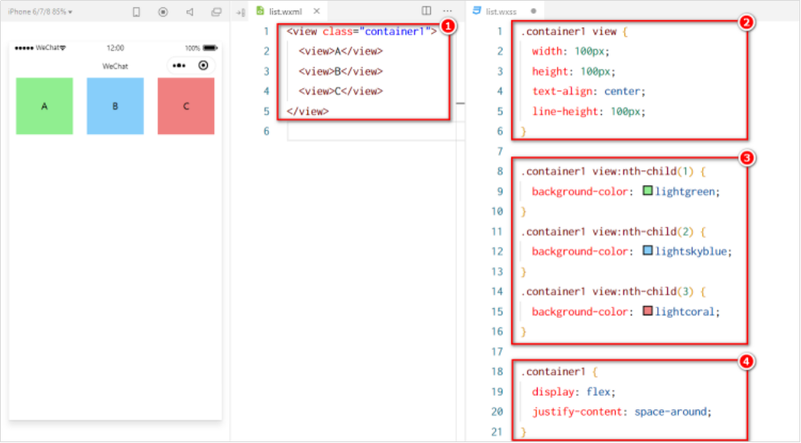


### scroll-view 组件的基本使用

实现如图的纵向滚动效果：

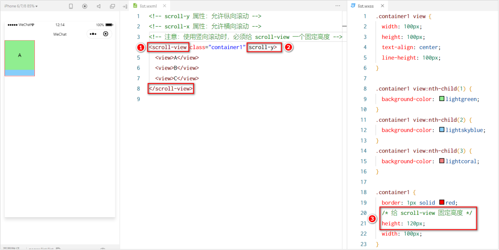


### swiper 和 swiper-item 组件的基本使用

实现如图的轮播图效果：

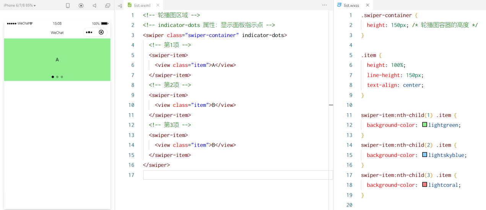


### swiper 组件的常用属性

|          属性          | 类型    | 默认值            | 说明                 |
| :--------------------: | ------- | ----------------- | -------------------- |
|     indicator-dots     | boolean | false             | 是否显示面板指示点   |
|    indicator-color     | color   | rgba(0, 0, 0, .3) | 指示点颜色           |
| indicator-active-color | color   | #000000           | 当前选中的指示点颜色 |
|        autoplay        | boolean | false             | 是否自动切换         |
|        interval        | number  | 5000              | 自动切换时间间隔     |
|        circular        | boolean | false             | 是否采用衔接滑动     |


### 常用的基础内容组件

1. text
   * 文本组件。
   * 类似于 HTML 中的 span 标签，是一个行内元素。
2. rich-text
   * 富文本组件。
   * 支持把 HTML 字符串渲染为 WXML 结构。


### text 组件的基本使用

通过 text 组件的 selectable 属性，实现长按选中文本内容的效果：

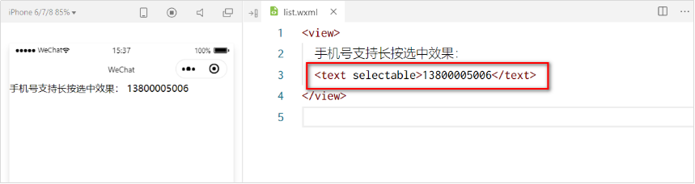


### rich-text 组件的基本使用

通过 rich-text 组件的 nodes 属性节点，把 HTML 字符串渲染为对应的 UI 结构：

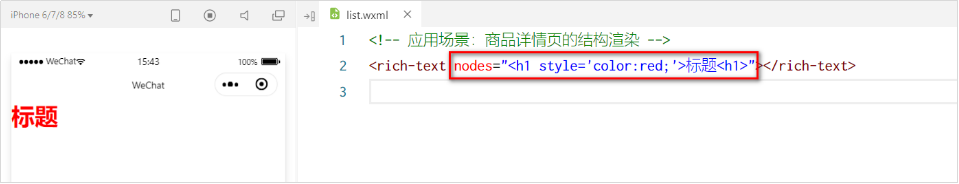


### 其它常用组件

1. button
   * 按钮组件。
   * 功能比 HTML 中的 button 按钮丰富。
   * 通过 open-type 属性可以调用微信提供的各种功能（客服、转发、获取用户授权、获取用户信息等）。
2. image
   * 图片组件。
   * image 组件默认宽度约 300px、高度约 240px
3. navigator
   * 页面导航组件
   * 类似于 HTML 中的 a 链接


### button 按钮的基本使用

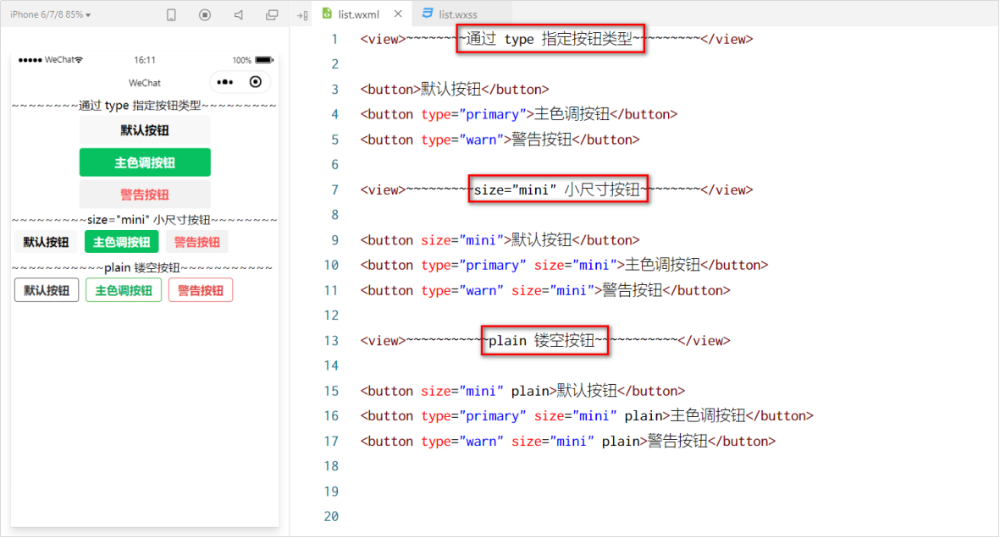


### image 组件的基本使用

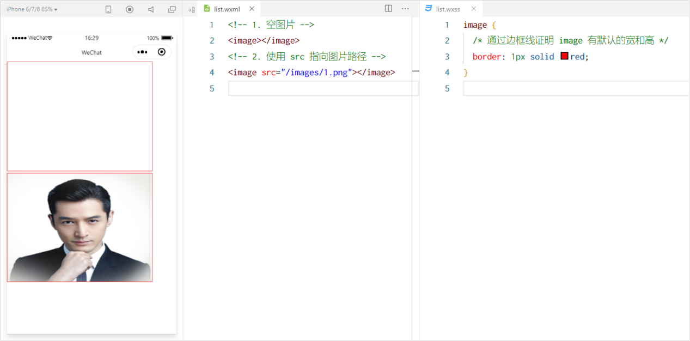


### image 组件的 mode 属性

image 组件的 mode 属性用来指定图片的裁剪和缩放模式，常用的 mode 属性值如下：

| mode 值     | 说明                                                         |
| ----------- | ------------------------------------------------------------ |
| scaleToFill | （默认值）缩放模式，不保持纵横比缩放图片，使图片的宽高完全拉伸至填满 image 元素 |
| aspectFit   | 缩放模式，保持纵横比缩放图片，使图片的长边能完全显示出来。也就是说，可以完整地将图片显示出来。 |
| aspectFill  | 缩放模式，保持纵横比缩放图片，只保证图片的短边能完全显示出来。也就是说，图片通常只在水平或垂直方向是完整的，另一个方向将会发生截取。 |
| widthFix    | 缩放模式，宽度不变，高度自动变化，保持原图宽高比不变         |
| heightFix   | 缩放模式，高度不变，宽度自动变化，保持原图宽高比不变         |


## API

### 小程序 API 概述

小程序中的 API 是由宿主环境提供的，通过这些丰富的小程序 API，开发者可以方便的调用微信提供的能力，例如：获取用户信息、本地存储、支付功能等。


### 小程序 API 的 3 大分类

小程序官方把 API 分为了如下 3 大类：

1. 事件监听 API
   * 特点：以 on 开头，用来监听某些事件的触发。
   * 举例：wx.onWindowResize(function callback) 监听窗口尺寸变化的事件。
2. 同步 API
   * 特点1：以 Sync 结尾的 API 都是同步 API。
   * 特点2：同步 API 的执行结果，可以通过函数返回值直接获取，如果执行出错会抛出异常。
   * 举例：wx.setStorageSync('key', 'value') 向本地存储中写入内容。
3. 异步 API
   * 特点：类似于 jQuery 中的 $.ajax(options) 函数，需要通过 success、fail、complete 接收调用的结果。
   * 举例：wx.request() 发起网络数据请求，通过 success 回调函数接收数据。


# 协同工作和发布

## 协同工作

### 了解权限管理需求

在中大型的公司里，人员的分工非常仔细：同一个小程序项目，一般会有不同岗位、不同角色的员工同时参与设计与开发。

此时出于管理需要，我们迫切需要对不同岗位、不同角色的员工的权限进行边界的划分，使他们能够高效的进行协同工作。


### 了解项目成员的组织结构

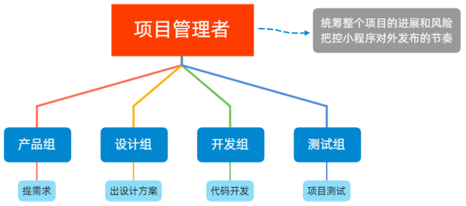


### 小程序的开发流程

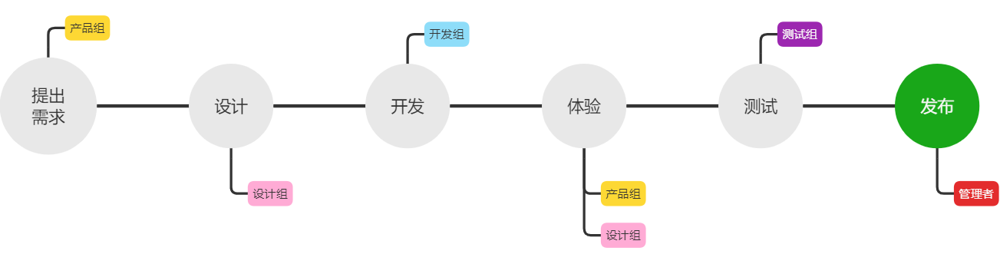


## 小程序成员管理

### 成员管理的两个方面

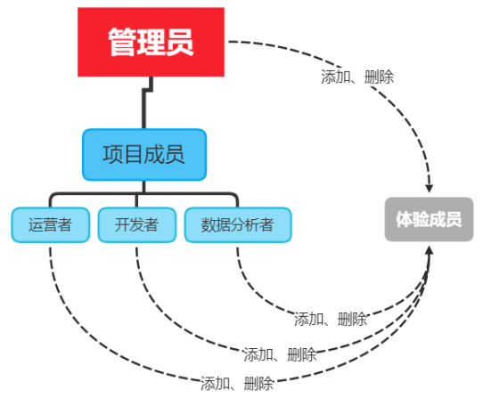

小程序成员管理体现在管理员对小程序项目成员及体验成员的管理：

1. 项目成员：
   * 表示参与小程序开发、运营的成员。
   * 可登录小程序管理后台。
   * 管理员可以添加、删除项目成员，并设置项目成员的角色。
2. 体验成员：
   * 表示参与小程序内测体验的成员。
   * 可使用体验版小程序，但不属于项目成员。
   * 管理员及项目成员均可添加、删除体验成员。


### 不同项目成员对应的权限

|      权限      | 运营者 | 开发者 | 数据分析者 |
| :------------: | :----: | :----: | :--------: |
|   开发者权限   |        |   √    |            |
|   体验者权限   |   √    |   √    |     √      |
|      登录      |   √    |   √    |     √      |
|    数据分析    |        |        |     √      |
|    微信支付    |   √    |        |            |
|      推广      |   √    |        |            |
|    开发管理    |   √    |        |            |
|    开发设置    |        |   √    |            |
|    暂停服务    |   √    |        |            |
| 解除关联公众号 |   √    |        |            |
|   腾讯云管理   |        |   √    |            |
|   小程序插件   |   √    |        |            |
|  游戏运营管理  |   √    |        |            |


### 开发者的权限说明

1. 开发者权限：可使用小程序开发者工具及对小程序的功能进行代码开发。
2. 体验者权限：可使用体验版小程序。
3. 登录权限：可登录小程序管理后台，无需管理员确认。
4. 开发设置：设置小程序服务器域名、消息推送及扫描普通链接二维码打开小程序。
5. 腾讯云管理：云开发相关设置。


### 添加项目成员和体验成员

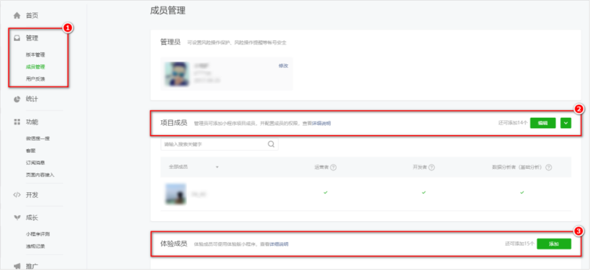


## 小程序的版本

### 软件开发过程中的不同版本

在软件开发过程中，根据时间节点的不同，会产出不同的软件版本，例如：

1. 开发者编写代码的同时，对项目代码进行自测（**开发版本**）。
2. 直到程序达到一个稳定可体验的状态时，开发者把体验版本给到产品经理和测试人员进行**体验测试**。
3. 最后修复完程序的 Bug 后，**发布正式版**供外部用户使用。


### 小程序的版本

|   版本阶段   |                             说明                             |
| :----------: | :----------------------------------------------------------: |
|   开发版本   | 使用开发者工具，可将代码上传到开发版本中。 开发版本只保留每人最新的一份上传的代码。点击提交审核，可将代码提交审核。开发版本可删除，不影响线上版本和审核中版本的代码。 |
|   体验版本   |     可以选择某个开发版本作为体验版，并且选取一份体验版。     |
| 审核中的版本 | 只能有一份代码处于审核中。有审核结果后可以发布到线上，也可直接重新提交审核，覆盖原审核版本。 |
|   线上版本   | 线上所有用户使用的代码版本，该版本代码在新版本代码发布后被覆盖更新。 |


## 发布上线

### 小程序发布上线的整体步骤

一个小程序的发布上线，一般要经过上传代码 -> 提交审核 -> 发布这三个步骤。


### 上传代码

1. 点击开发者工具顶部工具栏中的 “上传”  按钮。
2. 填写版本号以及项目备注。

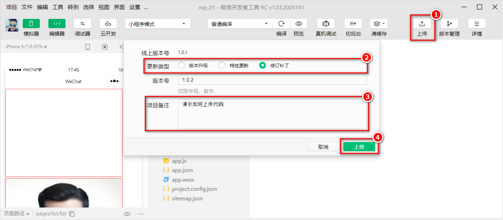


### 在后台查看上传之后的版本

登录小程序管理后台 -> 管理 -> 版本管理 -> 开发版本，即可查看刚才提交上传的版本了：

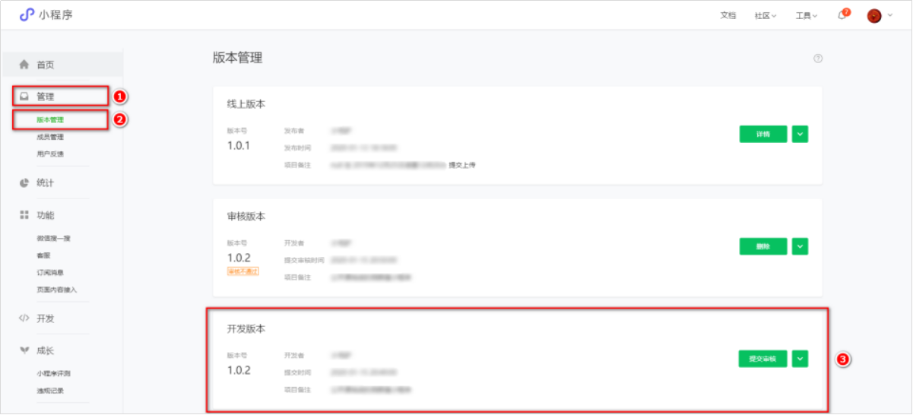


### 提交审核

* 为什么需要提交审核：为了保证小程序的质量，以及符合相关的规范，小程序的发布是需要经过腾讯官方审核的。
* 提交审核的方式：在开发版本的列表中，点击 “提交审核” 按钮之后，按照页面提示填写相关的信息，就能把小程序提交到腾讯官方进行审核

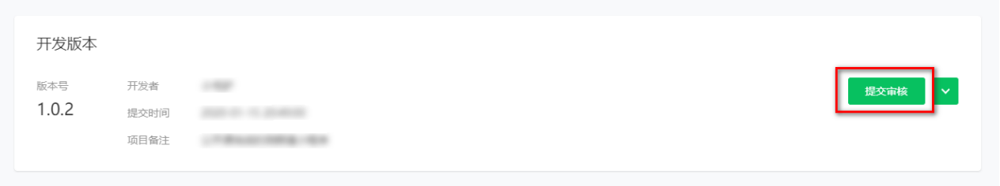


### 发布

审核通过之后，管理员的微信中会收到小程序通过审核的通知，此时在审核版本的列表中，点击 “发布” 按钮之后，即可把 “审核通过” 的版本发布为 “线上版本”，供所有小程序用户访问和使用。

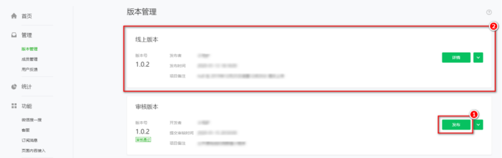


### 基于小程序码进行推广


相对于普通二维码来说，小程序码的优势如下：

1. 在样式上更具辨识度和视觉冲击力。
2. 能够更加清晰地树立小程序的品牌形象。
3. 可以帮助开发者更好地推广小程序。

获取小程序码的 5 个步骤：
登录小程序管理后台 -> 设置 -> 基本设置 -> 基本信息 -> 小程序码及线下物料下载。


## 运营数据

### 查看小程序运营数据的两种方式

1. 在 “小程序后台” 查看
   * 登录小程序管理后台。
   * 点击侧边栏的 “统计”。
   * 点击相应的 tab 可以看到相关的数据。
2. 使用 “小程序数据助手” 查看
   * 打开微信。
   * 搜索“小程序数据助手”。
   * 查看已发布的小程序相关的数据。


# 总结

1. 能够知道如何创建小程序项目
   * 微信开发者工具的使用、appID 的获取
2. 能够清楚小程序项目的基本组成结构
   * app.js、app.json、app.wxss、pages 文件夹
3. 能够知道小程序页面由几部分组成
   * wxml、wxss、json、js
4. 能够知道小程序中常见的组件如何使用
   * view、text、image
5. 能够知道小程序如何进行协同开发和发布
   * 成员管理、发布小程序、查看运营数据
