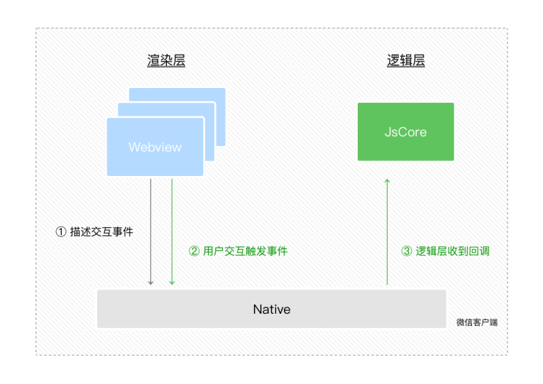
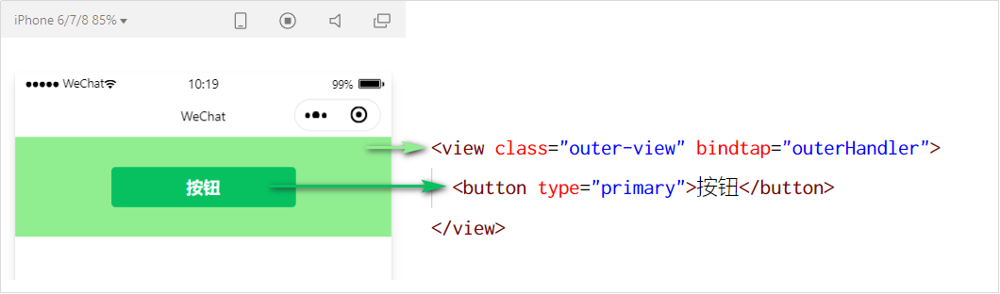
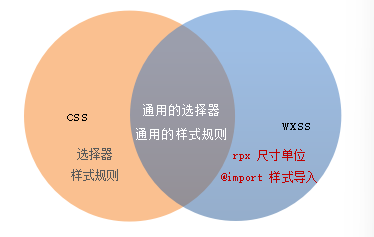
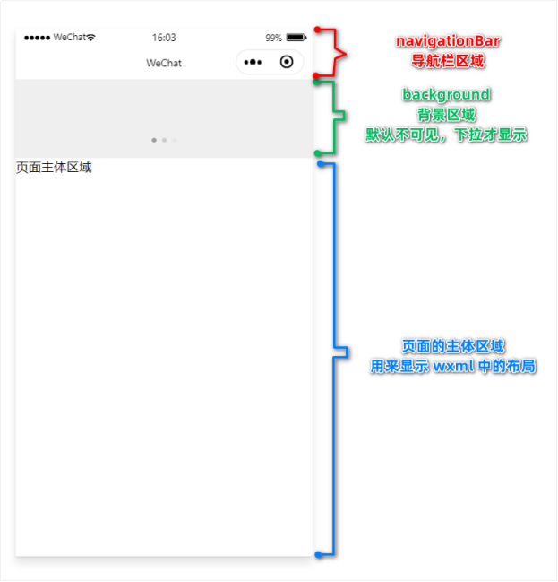
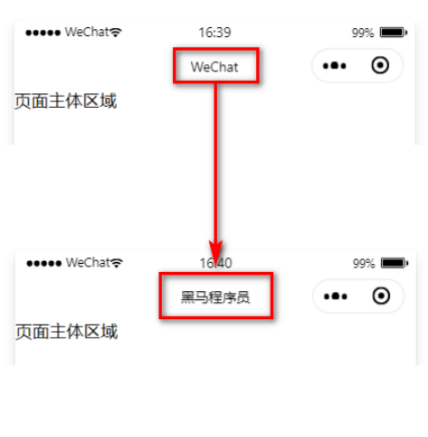

# WXML 模板语法

## 数据绑定

### 数据绑定的基本原则

1. 在 data 中定义数据。
2. 在 WXML 中使用数据。


### 在 data 中定义页面的数据

在页面对应的 .js 文件中，把数据定义到 data 对象中即可：

```js
Page({
  data: {
    // 字符串类型的数据
    info: 'init data',
    // 数组类型的数据
    msgList: [{msg: 'hello'}, {msg: 'world'}]
  },
})
```


### Mustache 语法的格式

把 data 中的数据绑定到页面中渲染，使用 Mustache 语法（双大括号）将变量包起来即可。语法格式为：

```html
<view>{{ 要绑定的数据名称 }}</view>
```


### Mustache 语法的应用场景

Mustache 语法的主要应用场景如下：

* 绑定内容
* 绑定属性
* 运算（三元运算、算术运算等）


### 动态绑定内容

页面的数据如下：

```js
Page({
  data: {
    info: 'init data'
  }
})
```

页面的结构如下：

```html
<view>{{ info }}</view>
```


### 动态绑定属性

页面的数据如下：

```js
Page({
  data: {
    imgSrc: 'http://www.itheima.com/images/logo.png'
  }
})
```

页面的结构如下：

```html
<image src="{{ imgSrc }}"></image>
```


### 三元运算

页面的数据如下：

```js
Page({
  data: {
    randomNum: Math.random() * 10	// 生成 10 以内的随机数
  }
})
```

页面的结构如下：

```html
<view>{{ randomNum >=5 ? '随机数字大于或等于5' : '随机数字小于5' }}</view>
```


### 算数运算

页面的数据如下：

```js
Page({
  data: {
    randomNum: Math.random().toFixed(2)	// 生成一个带两位小数的随机数，例如 0.34
  }
})
```

页面的结构如下：

```html
<view>生成100以内的随机数：{{ randomNum * 100 }}</view>
```


## 事件绑定

### 什么是事件

事件是渲染层到逻辑层的通讯方式。通过事件可以将用户在渲染层产生的行为，反馈到逻辑层进行业务的处理。




### 小程序中常用的事件

|  类型  |         绑定方式          |                    事件描述                     |
| :----: | :-----------------------: | :---------------------------------------------: |
|  tap   |    bindtap 或 bind:tap    | 手指触摸后马上离开，类似于 HTML 中的 click 事件 |
| input  |  bindinput 或 bind:input  |                文本框的输入事件                 |
| change | bindchange 或 bind:change |                 状态改变时触发                  |


### 事件对象的属性列表

当事件回调触发的时候，会收到一个事件对象 event，它的详细属性如下表所示：

|      属性      |  类型   |                     说明                     |
| :------------: | :-----: | :------------------------------------------: |
|      type      | String  |                   事件类型                   |
|   timeStamp    | Integer |       页面打开到触发事件所经过的毫秒数       |
|     target     | Object  |        触发事件的组件的一些属性值集合        |
| currentTarget  | Object  |           当前组件的一些属性值集合           |
|     detail     | Object  |                  额外的信息                  |
|    touches     |  Array  | 触摸事件，当前停留在屏幕中的触摸点信息的数组 |
| changedTouches |  Array  |     触摸事件，当前变化的触摸点信息的数组     |


### target 和 currentTarget 的区别

target 是触发该事件的源头组件，而 currentTarget 则是当前事件所绑定的组件。举例如下：



点击内部的按钮时，点击事件以冒泡的方式向外扩散，也会触发外层 view 的 tap 事件处理函数。
此时，对于外层的 view 来说：

* e.target 指向的是触发事件的源头组件，因此，e.target 是内部的按钮组件。
* e.currentTarget 指向的是当前正在触发事件的那个组件，因此，e.currentTarget 是当前的 view 组件。


### bindtap 的语法格式

在小程序中，不存在 HTML 中的 onclick 鼠标点击事件，而是通过 tap 事件来响应用户的触摸行为。

1. 通过 bindtap，可以为组件绑定 tap 触摸事件，语法如下：

   ```html
   <button type="primary" bind:tap="btnTapHandler">按钮</button>
   ```

2. 在页面的 .js 文件中定义对应的事件处理函数，事件参数通过形参 event（一般简写成 e） 来接收：

   ```js
   Page({
     btnTapHandler(e){
       console.log(e)
     }
   })
   ```

   

### 在事件处理函数中为 data 中的数据赋值

通过调用 this.setData(dataObject) 方法，可以给页面 data 中的数据重新赋值，示例如下：

```js
Page({
  data: {
     count: 0
  },
  // 修改 count 的值
  changeCount(){
     this.setData({
        count: this.data.count + 1
     })
  }
})
```


### 事件传参

小程序中的事件传参比较特殊，不能在绑定事件的同时为事件处理函数传递参数。例如，下面的代码将不能正常工作：

```html
<button type="primary" bind:tap="btnTapHandler(123)">事件传参</button>
```

因为小程序会把 bindtap 的属性值，统一当作事件名称来处理，相当于要调用一个名称为 btnHandler(123) 的事件处理函数。

可以为组件提供 data-* 自定义属性传参，其中 * 代表的是参数的名字，示例代码如下：

```html
<button type="primary" bind:tap="btnTapHandler" data-info="{{2}}">事件传参</button>
```

最终：

* info 会被解析为参数的名字
* 数值 2 会被解析为参数的值

在事件处理函数中，通过 event.target.dataset.参数名 即可获取到具体参数的值，示例代码如下：

```js
btnTapHandler(e) {
    // dataset 是一个对象，包含了所有通过 dsata-* 传递过来的参数项
    console.log(e.target.dataset)
    // 通过 dataset 可以访问到具体参数的值
    console.log(e.target.dataset.info)
},
```


### bindinput 的语法格式

在小程序中，通过 input 事件来响应文本框的输入事件，语法格式如下：

1. 通过 bindinput，可以为文本框绑定输入事件：

   ```html
   <input bindinput="inputHandler"></input>
   ```

2. 在页面的 .js 文件中定义事件处理函数：

   ```js
   inputHandler(e){
      // e.detail.value 是变化过后，文本框最新的值
      console.log(e.detail.value 是变化过后，文本框最新的值)
   }
   ```


### 实现文本框和 data 之间的数据同步

实现步骤：

1. 定义数据
2. 渲染结构
3. 美化样式
4. 绑定 input 事件处理函数

定义数据：

```js
Page({
   data: {
      msg: '你好，'
   }
})
```

渲染结构：

```html
<input value="{{msg}}" bindinput="iptHandler"></input>
```

美化样式：

```css
input{
   border: 1px solid #eee;
   padding: 5px;
   margin: 5px;
   border-radius: 3px;
}
```

绑定 input 事件处理函数：

```js
iptHandler(e){
   this.setData({
      // 通过 e.detail.value 获取到文本框最新的值
      msg: e.detail.value
   })
}
```


## 条件渲染

### wx:if

在小程序中，使用 wx:if="{{condition}}" 来判断是否需要渲染该代码块：

```html
<view wx:if="{{condition}}"> True </view>
```

也可以用 wx:elif 和 wx:else 来添加 else 判断：

```html
<view wx:if="{{type === 1}}"> 男 </view>
<view wx:elif="{{type === 2}}"> 女 </view>
<view wx:else> 保密 </view>
```


### 结合 `<block>` 使用 wx:if

如果要一次性控制多个组件的展示与隐藏，可以使用一个 `<block></block>` 标签将多个组件包装起来，并在`<block>` 标签上使用 wx:if 控制属性，示例如下：

```html
<block wx:if="{{true}}">
	<view> view1 </view>
    <view> view2 </view>
</block>
```

注意： `<block>` 并不是一个组件，它只是一个包裹性质的容器，不会在页面中做任何渲染。


### hidden

在小程序中，直接使用 hidden="{{ condition }}" 也能控制元素的显示与隐藏：

```html
<view hidden="{{ condition }}"> 条件为 true 隐藏，条件为 false 显示 </view>
```


### wx:if 与 hidden 的对比

1. 运行方式不同
   * wx:if 以动态创建和移除元素的方式，控制元素的展示与隐藏。
   * hidden 以切换样式的方式（display: none/block;），控制元素的显示与隐藏。
2. 使用建议
   * 频繁切换时，建议使用 hidden。
   * 控制条件复杂时，建议使用 wx:if 搭配 wx:elif、wx:else 进行展示与隐藏的切换。


## 列表渲染

### wx:for

通过 wx:for 可以根据指定的数组，循环渲染重复的组件结构，语法示例如下：

```html
<view wx:for="{{array}}">
	索引是：{{index}} 当前项：{{item}}
</view>
```

默认情况下，当前循环项的索引用 index 表示；当前循环项用 item 表示。


### 手动指定索引和当前项的变量名*

* 使用 wx:for-index 可以指定当前循环项的索引的变量名。
* 使用 wx:for-item 可以指定当前项的变量名。

```html
<view wx:for="{{array}}" wx:for-index="idx" wx:for-item="itemName">
	索引是：{{idx}} 当前项是：{itemName}
</view>
```


### wx:key 的使用

类似于 Vue 列表渲染中的 :key，小程序在实现列表渲染时，也建议为渲染出来的列表项指定唯一的 key 值，从而提高渲染的效率，示例代码如下：

```js
// data 数据
data: {
  info: '4',
  userList: [
    {id: 1,name = '小红'},
    {id: 2,name = '小黄'},
    {id: 3,name = '小白'},
  ]
}

// wxml 结构
<view wx:for="{{userList}}" wx:key="id">{{item.name}}</view>
```


# WXSS 模板样式

## 什么是 WXSS

WXSS (WeiXin Style Sheets)是一套样式语言，用于美化 WXML 的组件样式，类似于网页开发中的 CSS。


## WXSS 和 CSS 的关系

WXSS 具有 CSS 大部分特性，同时，WXSS 还对 CSS 进行了扩充以及修改，以适应微信小程序的开发。
与 CSS 相比，WXSS 扩展的特性有：

* rpx 尺寸单位
* @import 样式导入




## rpx

### 什么是 rpx 尺寸单位

rpx（responsive pixel）是微信小程序独有的，用来解决屏适配的尺寸单位。


### rpx 的实现原理

rpx 的实现原理非常简单：鉴于不同设备屏幕的大小不同，为了实现屏幕的自动适配，rpx 把所有设备的屏幕，在宽度上等分为 750 份（即：当前屏幕的总宽度为 750rpx）。

* 在较小的设备上，1rpx 所代表的宽度较小。
* 在较大的设备上，1rpx 所代表的宽度较大。

小程序在不同设备上运行的时候，会自动把 rpx 的样式单位换算成对应的像素单位来渲染，从而实现屏幕适配。


### rpx 与 px 之间的单位换算*

在 iPhone6 上，屏幕宽度为 375px，共有 750 个物理像素，等分为 750rpx。则：
750rpx = 375px = 750 物理像素
    1rpx = 0.5px  = 1物理像素

|     设备     | rpx换算px (屏幕宽度/750) | px换算rpx (750/屏幕宽度) |
| :----------: | :----------------------: | :----------------------: |
|   iPhone5    |      1rpx = 0.42px       |      1px = 2.34rpx       |
|   iPhone6    |       1rpx = 0.5px       |        1px = 2rpx        |
| iPhone6 Plus |      1rpx = 0.552px      |      1px = 1.81rpx       |

官方建议：开发微信小程序时，设计师可以用 iPhone6 作为视觉稿的标准。
开发举例：在 iPhone6 上如果要绘制宽 100px，高 20px 的盒子，换算成 rpx 单位，宽高分别为 200rpx 和 40rpx。


## 样式导入

### 什么是样式导入

使用 WXSS 提供的 @import 语法，可以导入外联的样式表。


### @import 的语法格式

@import 后跟需要导入的外联样式表的相对路径，用 ; 表示语句结束。示例如下：

```css
/** common.wxss **/
.small-p{
    padding:5px
}
```

```css
@import "common.wxss"
.middle-p{
    padding:15px
}
```


## 全局样式和局部样式

### 全局样式

定义在 app.wxss 中的样式为全局样式，作用于每一个页面。


### 局部样式

在页面的 .wxss 文件中定义的样式为局部样式，只作用于当前页面。

注意：

1. 当局部样式和全局样式冲突时，根据就近原则，局部样式会覆盖全局样式.。
2. 当局部样式的权重大于或等于全局样式的权重时，才会覆盖全局的样式。


# 全局配置

## 全局配置文件及常用的配置项

小程序根目录下的 app.json 文件是小程序的全局配置文件。常用的配置项如下：

1. pages
   * 记录当前小程序所有页面的存放路径
2. window
   * 全局设置小程序窗口的外观
3. tabBar
   * 设置小程序底部的  tabBar 效果
4. style
   * 是否启用新版的组件样式


## window

### 小程序窗口的组成部分




### 了解 window 节点常用的配置项

|            属性名            |   类型   | 默认值  |                      说明                      |
| :--------------------------: | :------: | :-----: | :--------------------------------------------: |
|    navigationBarTitleText    |  String  | 字符串  |               导航栏标题文字内容               |
| navigationBarBackgroundColor | HexColor | #000000 |           导航栏背景颜色，如 #000000           |
|    navigationBarTextStyle    |  String  |  white  |      导航栏标题颜色，仅支持 black / white      |
|       backgroundColor        | HexColor | #ffffff |                  窗口的背景色                  |
|     backgroundTextStyle      |  String  |  dark   |    下拉 loading 的样式，仅支持 dark / light    |
|    enablePullDownRefresh     | Boolean  |  false  |              是否全局开启下拉刷新              |
|    onReachBottomDistance     |  Number  |   50    | 页面上拉触底事件触发时距页面底部距离，单位为px |


### 设置导航栏的标题

设置步骤：app.json -> window -> navigationBarTitleText
需求：把导航栏上的标题，从默认的 “WeChat”修改为“黑马程序员”，效果如图所示：


