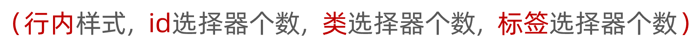

# CSS进阶

> 目标：掌握复合选择器作用和写法；使用background属性添加背景效果


## 复合选择器

定义：由两个或多个基础选择器，通过不同的方式组合而成。

作用：更准确、更高效的选择目标元素（标签）。


### 后代选择器

后代选择器：**选中某元素的后代元素**。

选择器写法：父选择器  子选择器 { CSS 属性}，父子选择器之间用**空格**隔开。

```html
<style>
  div span {
    color: red;
  }
</style>
<span> span 标签</span>
<div>
  <span>这是 div 的儿子 span</span >
</div>
```


### 子代选择器

子代选择器：选中某元素的子代元素（**最近的子级**）。

选择器写法：父选择器 > 子选择器 { CSS 属性}，父子选择器之间用 **>** 隔开。

```html
<style>
  div > span {
    color: red;
  }
</style>

<div>
  <span>这是 div 里面的 span</span>
  <p>
    <span>这是 div 里面的 p 里面的 span</span>
  </p>
</div>
```


### 并集选择器

并集选择器：选中**多组标签**设置**相同**的样式。

选择器写法：选择器1, 选择器2, …, 选择器N { CSS 属性}，选择器之间用 **,** 隔开。

```html
<style>
  div,
  p,
  span {
    color: red;
  }
</style>

<div> div 标签</div>
<p>p 标签</p>
<span>span 标签</span>
```


### 交集选择器

交集选择器：选中**同时满足多个条件**的元素。

选择器写法：选择器1选择器2 { CSS 属性}，选择器之间连写，没有任何符号。 

```html
<style>
  p.box {
  color: red;
}
</style>

<p class="box">p 标签，使用了类选择器 box</p>
<p>p 标签</p>
<div class="box">div 标签，使用了类选择器 box</div>
```


### 伪类选择器 

伪类选择器：伪类表示元素**状态**，选中元素的某个状态设置样式。

鼠标悬停状态：**选择器:hover { CSS 属性 }**

```html
<style>
  a:hover {
    color: red;
  }
  .box:hover {
    color: green;
  }
</style>

<a href="#">a 标签</a>
<div class="box">div 标签</div>
```


#### 超链接伪类

| 选择器   | 作用           |
| -------- | -------------- |
| :link    | 访问前         |
| :visited | 访问后         |
| :hover   | 鼠标悬停       |
| :active  | 点击时（激活） |

> 提示：如果要给超链接设置以上四个状态，需要按 LVHA 的顺序书写。 
>
> 经验：工作中，一个 a 标签选择器设置超链接的样式， hover 状态特殊设置 

```css
a {
  color: red;
}

a:hover {
  color: green;
}
```


## CSS特性

CSS特性：化简代码 / 定位问题，并解决问题

* 继承性
* 层叠性
* 优先级


### 继承性

继承性：子级默认继承父级的**文字控制属性**。 

| 描述         | 属性            | 效果 |
| ------------ | --------------- | ---- |
| 字体大小     | font-size       |      |
| 字体粗细     | font-weight     |      |
| 字体倾斜     | font-style      |      |
| 行高         | line-height     |      |
| 字体族       | font-family     |      |
| 字体复合属性 | font            |      |
| 文本缩进     | text-indent     |      |
| 文本对齐     | text-align      |      |
| 修饰线       | text-decoration |      |
| 颜色         | color           |      |

> 注意：如果标签有默认文字样式会继承失败。例如：a 标签的颜色、标题的字体大小。


### 层叠性

特点：

* 相同的属性会覆盖：**后面的 CSS 属性覆盖前面的 CSS 属性**
* 不同的属性会叠加：**不同的 CSS 属性都生效**

```css
<style>
  div {
    color: red;
    font-weight: 700;
  }
  div {
    color: green;
    font-size: 30px;
  }
</style>

<div>div 标签</div>
```

> 注意：选择器类型相同则遵循层叠性，否则按选择器优先级判断。 


### 优先级

优先级：也叫权重，当一个标签**使用了多种选择器时**，基于不同种类的选择器的**匹配规则**。

```html
<style>
  div {
    color: red;
  }
  .box {
    color: green;
  }
</style>

<div class="box">div 标签</div>
```


#### 基础选择器

规则：选择器**优先级高的样式生效**。

公式：**通配符选择器 < 标签选择器 < 类选择器 < id选择器 < 行内样式 < !important**

​           **（选中标签的范围越大，优先级越低）**


#### 复合选择器-叠加

叠加计算：如果是复合选择器，则需要**权重叠加**计算。

公式：（每一级之间不存在进位）



规则：

* 从左向右依次比较选个数，同一级个数多的优先级高，如果个数相同，则向后比较
* **!important 权重最高**
* 继承权重最低


## Emmet 写法

Emmet写法：代码的**简写**方式，输入缩写 VS Code 会自动生成对应的代码。 

* HTML 标签

  | 说明         | 标签结构                                     | Emmet         |
  | ------------ | -------------------------------------------- | ------------- |
  | 类选择器     | `<div class="box"></div>`                    | 标签名.类名   |
  | id 选择器    | `<div id="box"></div>`                       | `标签名#id名` |
  | 同级标签     | `<div></div><p></p>`                         | `div+p`       |
  | 父子级标签   | `<div><p></p></div>`                         | `div>p`       |
  | 多个相同标签 | `<span>1</span><span>2</span><span>3</span>` | `span*3`      |
  | 有内容的标签 | `<div>内容</div>`                            | `div{内容}`   |

  

* CSS：大多数简写方式为属性单词的**首字母** 
